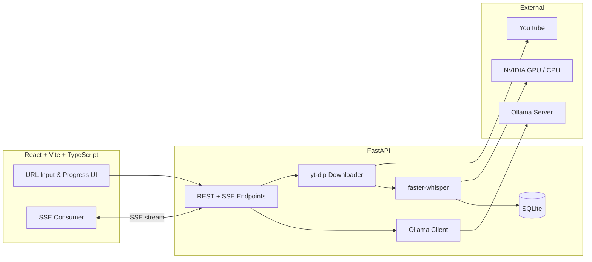

# YouTube Transcript Generator

> **Full-stack AI pipeline** — YouTube URL → Whisper transcription → Ollama translation & summarization → export-ready subtitles.

[](https://www.python.org/)
[](https://fastapi.tiangolo.com/)
[](https://react.dev/)
[](https://www.typescriptlang.org/)
[](https://github.com/SYSTRAN/faster-whisper)
[](https://ollama.com/)

**[🇹🇷 Türkçe README](README.tr.md)**

---

## Overview

A locally hosted web application that turns any YouTube video into a **timestamped transcript**, then layers **LLM-powered translation, summarization, and prompt generation** on top — all without sending data to third-party cloud APIs.

Built as a portfolio project to demonstrate end-to-end ownership: from GPU-accelerated ML inference and real-time streaming APIs to a polished React frontend.

<p align="center">
  
</p>

---

## What This Project Demonstrates

| Area | Highlights |
|------|------------|
| **AI / ML Engineering** | faster-whisper (`large-v3`) with VAD filtering, segment-level progress, GPU/CPU auto-selection |
| **GPU Runtime** | Custom CUDA 12 DLL bootstrap for RTX 50-series on Windows; graceful CPU fallback with optimized model sizing |
| **Backend Architecture** | FastAPI, async SSE pipelines, SQLAlchemy persistence, modular service layer |
| **LLM Integration** | Ollama streaming chat API for translation, summarization, and structured prompt templates |
| **Frontend Engineering** | React 19 + TypeScript + Tailwind CSS 4, real-time progress UI, transcript search & export |
| **DevOps Mindset** | Health checks, GPU verification scripts, e2e smoke tests, environment-based configuration |

---

## Features

### Core Pipeline
- Paste a YouTube URL → **audio download** (yt-dlp) → **Whisper transcription** with per-segment timestamps
- **Live progress** via Server-Sent Events — download, transcribe, and save stages with elapsed time
- **In-transcript search** with instant highlighting

### AI-Powered Layer (Ollama)
- **Streaming translation** into 10 target languages (Turkish, English, German, French, Spanish, Arabic, Japanese, Korean, Russian, Chinese)
- **Video summarization** powered by local LLMs
- **Prompt templates** ready to paste into NotebookLM / ChatGPT:
  - Detailed notes · Bullet summary · Rules & tips · Study guide · Quiz generator

### Data & Export
- **SQLite history** — revisit past transcripts without re-processing
- **Export formats:** plain text (`.txt`), SubRip (`.srt`), WebVTT (`.vtt`)
- One-click copy for prompts and translated text

### Reliability
- **CUDA runtime probe** at startup — detects missing `cublas64_12.dll` before inference fails
- **Automatic CPU fallback** if GPU load or inference throws a CUDA error
- Smarter CPU model selection (`medium` vs `large-v3`) to keep long videos practical

---

## Architecture



---

## Tech Stack

**Backend**
- FastAPI · Uvicorn · Pydantic v2 · SQLAlchemy 2
- faster-whisper (CTranslate2) · yt-dlp · httpx
- sse-starlette · nvidia-cublas/cudnn/nvrtc (CUDA 12 runtime)

**Frontend**
- React 19 · TypeScript 6 · Vite 8 · Tailwind CSS 4
- Custom UI components · SSE client · no heavy UI framework

**Infrastructure**
- SQLite · FFmpeg · Ollama (local LLM server)
- Optional NVIDIA GPU with intelligent CPU fallback

---

## Quick Start

### Prerequisites

| Tool | Version |
|------|---------|
| Python | 3.11+ |
| Node.js | 20+ |
| FFmpeg | required for audio conversion |
| Ollama | running locally (`ollama serve`) |
| NVIDIA GPU | optional — CPU fallback included |

### 1. Pull an Ollama model

```bash
ollama pull qwen2.5:14b
```

### 2. Start the backend

```bash
cd backend
python -m venv .venv
source .venv/Scripts/activate   # Git Bash / macOS / Linux
pip install -r requirements.txt
uvicorn app.main:app --reload --host 127.0.0.1 --port 8000
```

Verify GPU (optional):

```bash
python scripts/verify_gpu.py
```

### 3. Start the frontend

```bash
cd frontend
npm install
npm run dev
```

Open **http://localhost:5173**

---

## API Endpoints

| Method | Endpoint | Description |
|--------|----------|-------------|
| `POST` | `/api/transcribe` | SSE — download + transcribe + save |
| `GET` | `/api/transcripts/{id}` | Fetch saved transcript |
| `POST` | `/api/translate` | SSE — stream translation |
| `POST` | `/api/summarize` | Generate video summary |
| `POST` | `/api/generate-prompt` | Build AI-ready prompts |
| `GET` | `/api/history` | Transcript history |
| `GET` | `/api/models` | List Ollama models |
| `GET` | `/api/export/{id}/{format}` | Export as `txt` / `srt` / `vtt` |
| `GET` | `/api/health` | Health + CUDA status |

---

## Configuration

Create `backend/.env` (optional):

```env
OLLAMA_BASE_URL=http://127.0.0.1:11434
DEFAULT_OLLAMA_MODEL=qwen2.5:14b
WHISPER_DEVICE=auto
WHISPER_MODEL=large-v3
```

Force CPU if CUDA issues persist:

```env
WHISPER_DEVICE=cpu
```

---

## Project Structure

```
youtube-transcript-generator/
├── backend/
│   ├── app/
│   │   ├── routers/        # API routes (transcribe, translate, history…)
│   │   ├── services/       # Whisper, Ollama, downloader, summarizer
│   │   ├── cuda_setup.py   # CUDA 12 DLL path bootstrap (Windows)
│   │   └── utils/          # SSE helpers, SRT/VTT export
│   └── scripts/            # GPU verify, e2e smoke test, start scripts
├── frontend/
│   └── src/                # React app, API client, UI components
└── docs/                   # API, deployment, and UI documentation
```

---

## GPU Notes (RTX 50-series / CUDA 13 driver)

CTranslate2 requires **CUDA 12** DLLs (`cublas64_12.dll`), even when your driver reports CUDA 13 support. This project ships with:

- `nvidia-cublas-cu12`, `nvidia-cudnn-cu12`, `nvidia-cuda-nvrtc-cu12` in `requirements.txt`
- `cuda_setup.py` — injects pip-installed DLL paths into `PATH` before model load
- Runtime probe + inference-time fallback to CPU

Check status: `GET /api/health` → `"cuda": {"cuda_available": true}`

---

## Disclaimer

For personal and local use. Respect YouTube's Terms of Service when downloading content.

---

## Author

**Eren Kamer** — [GitHub @erenkamer1](https://github.com/erenkamer1)

If this project caught your eye — feel free to reach out. I'm open to opportunities in full-stack and AI engineering.
