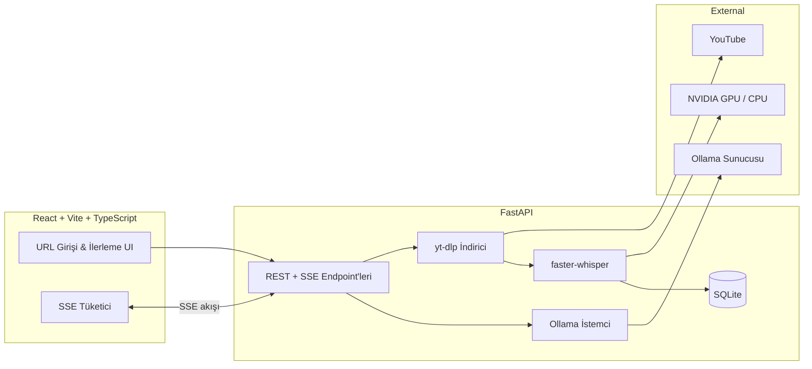

# YouTube Transkript Üretici

> **Uçtan uca AI pipeline** — YouTube URL → Whisper transkripsiyon → Ollama çeviri & özet → altyazı dışa aktarma.

[](https://www.python.org/)
[](https://fastapi.tiangolo.com/)
[](https://react.dev/)
[](https://www.typescriptlang.org/)
[](https://github.com/SYSTRAN/faster-whisper)
[](https://ollama.com/)

**[🇬🇧 English README](README.md)**

---

## Genel Bakış

Herhangi bir YouTube videosunu **zaman damgalı transkripte** dönüştüren, ardından **LLM destekli çeviri, özet ve prompt üretimi** ekleyen yerel bir web uygulaması. Veriler üçüncü taraf bulut API'lerine gönderilmez — tüm işlem kendi makinenizde çalışır.

Portfolyo projesi olarak tasarlandı: GPU hızlandırmalı ML çıkarımından gerçek zamanlı streaming API'lere, modern React arayüzüne kadar uçtan uca mühendislik becerilerini göstermek için.

<p align="center">
  
</p>

---

## Bu Proje Neleri Gösteriyor?

| Alan | Öne Çıkanlar |
|------|--------------|
| **AI / ML Mühendisliği** | faster-whisper (`large-v3`), VAD filtreleme, segment bazlı ilerleme, GPU/CPU otomatik seçim |
| **GPU Runtime** | RTX 50 serisi için özel CUDA 12 DLL bootstrap; akıllı CPU fallback ve model boyutu optimizasyonu |
| **Backend Mimarisi** | FastAPI, async SSE pipeline'ları, SQLAlchemy kalıcılık, modüler servis katmanı |
| **LLM Entegrasyonu** | Ollama streaming chat API — çeviri, özet ve yapılandırılmış prompt şablonları |
| **Frontend Mühendisliği** | React 19 + TypeScript + Tailwind CSS 4, canlı ilerleme UI, transkript arama & dışa aktarma |
| **DevOps Yaklaşımı** | Health check, GPU doğrulama scriptleri, e2e smoke test, ortam değişkeni yapılandırması |

---

## Özellikler

### Ana Pipeline
- YouTube URL yapıştır → **ses indirme** (yt-dlp) → **Whisper transkripsiyon** (segment zaman damgalarıyla)
- **Canlı ilerleme** — Server-Sent Events ile indirme, transkripsiyon ve kayıt aşamaları + geçen süre
- Transkript içinde **anında arama** ve vurgulama

### AI Katmanı (Ollama)
- 10 hedef dile **akışlı çeviri** (Türkçe, İngilizce, Almanca, Fransızca, İspanyolca, Arapça, Japonca, Korece, Rusça, Çince)
- Yerel LLM ile **video özeti**
- NotebookLM / ChatGPT'ye yapıştırmaya hazır **prompt şablonları**:
  - Detaylı not · Madde madde özet · Kurallar & püf noktaları · Çalışma rehberi · Quiz üretici

### Veri & Dışa Aktarma
- **SQLite geçmiş** — eski transkriptlere yeniden işlem yapmadan erişim
- **Dışa aktarma:** düz metin (`.txt`), SubRip (`.srt`), WebVTT (`.vtt`)
- Prompt ve çeviri metni için tek tıkla kopyalama

### Güvenilirlik
- Başlangıçta **CUDA runtime kontrolü** — `cublas64_12.dll` eksikliğini inference öncesi tespit
- GPU yükleme veya inference hatasında **otomatik CPU fallback**
- Uzun videolarda pratik süre için akıllı CPU model seçimi (`medium` vs `large-v3`)

---

## Mimari



---

## Teknoloji Yığını

**Backend**
- FastAPI · Uvicorn · Pydantic v2 · SQLAlchemy 2
- faster-whisper (CTranslate2) · yt-dlp · httpx
- sse-starlette · nvidia-cublas/cudnn/nvrtc (CUDA 12 runtime)

**Frontend**
- React 19 · TypeScript 6 · Vite 8 · Tailwind CSS 4
- Özel UI bileşenleri · SSE istemci · ağır UI framework yok

**Altyapı**
- SQLite · FFmpeg · Ollama (yerel LLM sunucusu)
- Opsiyonel NVIDIA GPU + akıllı CPU fallback

---

## Hızlı Başlangıç

### Gereksinimler

| Araç | Sürüm |
|------|-------|
| Python | 3.11+ |
| Node.js | 20+ |
| FFmpeg | ses dönüşümü için zorunlu |
| Ollama | yerelde çalışıyor olmalı (`ollama serve`) |
| NVIDIA GPU | opsiyonel — CPU fallback dahil |

### 1. Ollama modeli indir

```bash
ollama pull qwen2.5:14b
```

### 2. Backend'i başlat

```bash
cd backend
python -m venv .venv
source .venv/Scripts/activate   # Git Bash
pip install -r requirements.txt
uvicorn app.main:app --reload --host 127.0.0.1 --port 8000
```

GPU doğrulama (opsiyonel):

```bash
python scripts/verify_gpu.py
```

### 3. Frontend'i başlat

```bash
cd frontend
npm install
npm run dev
```

Tarayıcıda aç: **http://localhost:5173**

---

## API Endpoint'leri

| Metod | Endpoint | Açıklama |
|-------|----------|----------|
| `POST` | `/api/transcribe` | SSE — indir + transkribe et + kaydet |
| `GET` | `/api/transcripts/{id}` | Kayıtlı transkript |
| `POST` | `/api/translate` | SSE — akışlı çeviri |
| `POST` | `/api/summarize` | Video özeti |
| `POST` | `/api/generate-prompt` | AI prompt üretimi |
| `GET` | `/api/history` | Geçmiş kayıtları |
| `GET` | `/api/models` | Ollama modelleri |
| `GET` | `/api/export/{id}/{format}` | `txt` / `srt` / `vtt` dışa aktar |
| `GET` | `/api/health` | Sağlık + CUDA durumu |

---

## Yapılandırma

`backend/.env` oluşturun (opsiyonel):

```env
OLLAMA_BASE_URL=http://127.0.0.1:11434
DEFAULT_OLLAMA_MODEL=qwen2.5:14b
WHISPER_DEVICE=auto
WHISPER_MODEL=large-v3
```

CUDA sorunu devam ederse CPU'ya zorla:

```env
WHISPER_DEVICE=cpu
```

---

## Proje Yapısı

```
youtube-transcript-generator/
├── backend/
│   ├── app/
│   │   ├── routers/        # API route'ları (transcribe, translate, history…)
│   │   ├── services/       # Whisper, Ollama, indirici, özetleyici
│   │   ├── cuda_setup.py   # CUDA 12 DLL path bootstrap (Windows)
│   │   └── utils/          # SSE yardımcıları, SRT/VTT export
│   └── scripts/            # GPU doğrulama, e2e test, başlatma scriptleri
├── frontend/
│   └── src/                # React uygulaması, API istemci, UI bileşenleri
└── docs/                   # API, deployment ve UI dokümantasyonu
```

---

## GPU Notları (RTX 50 serisi / CUDA 13 sürücü)

CTranslate2, sürücünüz CUDA 13 desteklese bile **CUDA 12** DLL'leri (`cublas64_12.dll`) gerektirir. Bu projede:

- `nvidia-cublas-cu12`, `nvidia-cudnn-cu12`, `nvidia-cuda-nvrtc-cu12` — `requirements.txt` içinde
- `cuda_setup.py` — pip ile kurulan DLL yollarını model yüklenmeden önce `PATH`'e ekler
- Runtime kontrolü + inference sırasında CPU'ya otomatik düşme

Durum kontrolü: `GET /api/health` → `"cuda": {"cuda_available": true}`

---

## Sorumluluk Reddi

Kişisel ve yerel kullanım içindir. İçerik indirirken YouTube Kullanım Koşulları'na dikkat edin.

---

## Geliştirici

**Eren Kamer** — [GitHub @erenkamer1](https://github.com/erenkamer1)

Bu projeyi incelediyseniz ve ilginizi çektiyse iletişime geçmekten çekinmeyin. Full-stack ve AI mühendisliği alanında fırsatlara açığım.
